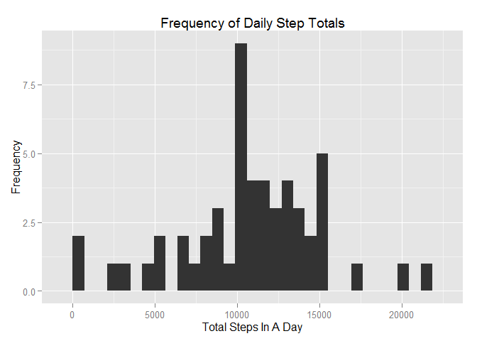
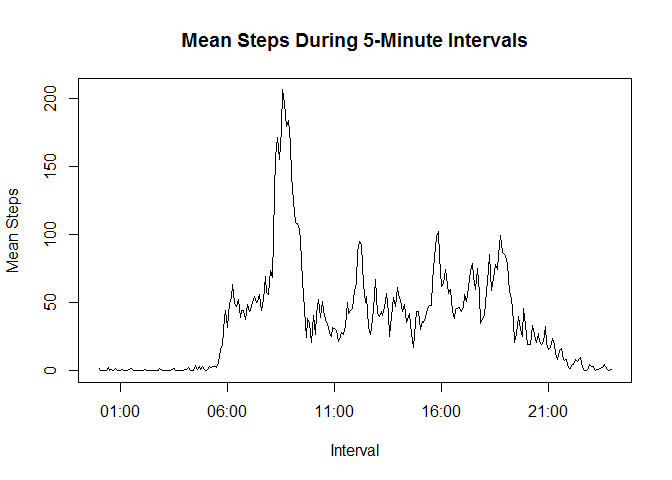
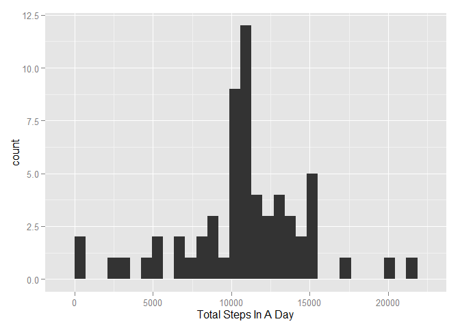
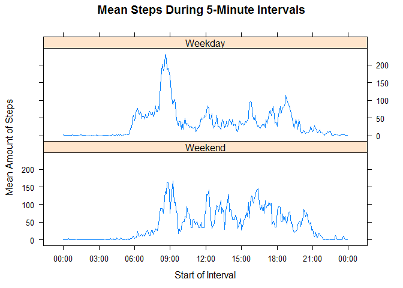

# Reproducible Research: Peer Assessment 1
This document details the processing and analysis of data from a personal activity monitoring device. It contains snippets of R code that can be run in the free R software to obtain the specified results. (For more info about R or to download your copy, feel free to visit <http://www.r-project.org/>).  The code will work so long as the ["activity.zip"](https://github.com/rdpeng/RepData_PeerAssessment1/raw/master/activity.zip) file from Dr. Roger Peng's Github repository is located in your working directory and the ggplot2 and lattice packages have been installed in your copy of R.

## Loading and preprocessing the data
Before we analyze the data, we need to import it.


```r
act <- read.csv(unzip("activity.zip"))
```

Note that this dataframe has 3 columns: steps, date, and interval.  It's important to note the presence of some NAs in the steps column.  It is also helpful to note that the interval column specifies 24-hour times in a somewhat unconventional integer format. Loosely speaking, the integer sequence is HHMM, but for times before 10:00a.m. there is a fair amount of variation in the specific pattern (e.g. 12:00a.m. is 0, 2:35a.m. is 235).  This may introduce a wrinkle into some of our analysis.


```r
str(act)
```

```
## 'data.frame':	17568 obs. of  3 variables:
##  $ steps   : int  NA NA NA NA NA NA NA NA NA NA ...
##  $ date    : Factor w/ 61 levels "2012-10-01","2012-10-02",..: 1 1 1 1 1 1 1 1 1 1 ...
##  $ interval: int  0 5 10 15 20 25 30 35 40 45 ...
```

```r
head(act$interval, n = 36)
```

```
##  [1]   0   5  10  15  20  25  30  35  40  45  50  55 100 105 110 115 120
## [18] 125 130 135 140 145 150 155 200 205 210 215 220 225 230 235 240 245
## [35] 250 255
```

We'll deal with the time format of the data later, but for now I think it would be a good idea to create a reduced data set that omits the rows containing NAs in the steps column.


```r
valid.act <- act[!is.na(act$steps),]
valid.act$date <- factor(as.character(valid.act$date))
```

The second line of the code above was added to make sure that the date factor doesn't keep unused levels.  Now that we have explored the structure of the data and even produced a dataset with the NA entries omitted, it's time to start answering questions.

## What is the mean total number of steps taken per day?
Let's look at a histogram of the number of steps taken each day.


```r
library(ggplot2)
step.by.day <- data.frame(tapply(valid.act$steps, valid.act$date, sum))
colnames(step.by.day) <- "total.steps"
step.by.day$date <- rownames(step.by.day)
step.by.day$total.steps <- as.vector(step.by.day[[1]])
rownames(step.by.day) <- NULL
qplot(step.by.day$total.steps, geom = "histogram", 
  	xlab = "Total Steps In A Day", ylab = "Frequency",
		main = "Frequency of Daily Step Totals")
```

 

Note that the above histogram gives an indication of the frequency with which specific daily step totals occur. If we simply wanted to see a scatterplot of the daily step totals for each day we could try plotting:


```r
day.number <- as.numeric(as.Date(step.by.day$date) - as.Date("2012-09-30"))
qplot(x = day.number, y = step.by.day$total.steps,
		geom = "point", xlab = "Day", ylab = "Frequency",
		main = "Daily Step Totals")
```

I've omitted the scatterplot produced by this latter chunk of code because I don't want it to be confused with the histogram. The histogram seems more relevant when it comes discussion of the mean and median daily totals. Note that we can compute the mean and median fairly easily in R.


```r
mean(step.by.day$total.steps)
```

```
## [1] 10766.19
```

```r
median(step.by.day$total.steps)
```

```
## [1] 10765
```

## What is the average daily activity pattern?
Daily totals are intriguing, but we'd also like to know what happens in a typical day. How do the activity levels vary? To conduct this sort of analysis, we may need to restructure our data a little bit. Specifically, we may find it helpful to re-format the "interval" variable as a factor. Once that is accomplished, we can find the mean number of steps taken for each 5-minute interval using the tapply() function in R. For the purposes of making a time-series plot in R, it may also be helpful to produce a vector of the interval times in a more R-friendly format.


```r
valid.act$interval <- factor(valid.act$interval)
data.intervals <- tapply(valid.act$steps, valid.act$interval, mean)
time.of.day <- rownames(data.intervals)
time.of.day <- formatC(as.numeric(time.of.day), width=4, flag="0")
time.of.day <- strptime(time.of.day, format = "%H%M")
mean.steps.interval <- as.vector(data.intervals)
data.intervals <- data.frame(format(time.of.day, "%H:%M"), mean.steps.interval)
colnames(data.intervals) <- c("interval.start", "mean.steps")
plot(y = mean.steps.interval, x = time.of.day, type = "l",
		xlab = "Interval", ylab = "Mean Steps", 
		main = "Mean Steps During 5-Minute Intervals")
```

 

We can find the interval that, on average, contains the maximum number of steps by extracting the row of the plotted data that corresponds to the highest mean value:


```r
data.intervals[order(mean.steps.interval, decreasing = TRUE)[1],]
```

```
##     interval.start mean.steps
## 104          08:35   206.1698
```

It turns out that the interval between 8:35am and 8:40am tends to have the highest number of steps.

## Inputting missing values
Recall that our original data had missing data. For much of this analysis, we have essentially disregarded those entries, but suppose we wanted to fill those values in. How could we proceed?  It makes sense to try replacing the NA entries with a "likely" value.  While "likely" is definitely open to interpretation, I think a reasonable procedure would be to replace empty entries with the mean number of steps typically taken during that time of day. We can implement this procedure pretty easily in R using a for-loop. We'll save our results in a new dataset.


```r
f.act <- act
f.act$interval.id <- rep(1:288, times = length(f.act$interval)/288)
for(j in seq_along(f.act$steps)){
	if(is.na(f.act$steps[j])) f.act$steps[j] <- mean.steps.interval[f.act$interval.id[j]]
}
```

Let's look at a histogram of this new "filled-in" dataset:


```r
library(ggplot2)
f.step.by.day <- data.frame(tapply(f.act$steps, f.act$date, sum))
colnames(f.step.by.day) <- "total.steps"
f.step.by.day$date <- rownames(f.step.by.day)
f.step.by.day$total.steps <- as.vector(f.step.by.day[[1]])
qplot(f.step.by.day$total.steps, geom = "histogram", 
		xlab = "Total Steps In A Day")
```

 

The histogram looks a little different than our previous plot, but it seems to have roughly the same shape. Let's check out the mean and median:


```r
mean(f.step.by.day$total.steps)
```

```
## [1] 10766.19
```

```r
median(f.step.by.day$total.steps)
```

```
## [1] 10766.19
```

The mean is the same as in the reduced data set, but the median has increased slightly (it's actually assumed the value of the mean). I guess the impact on the data wasn't too drastic.  Nevertheless, it's probably important to keep in mind that the structure of this data set was unqiue. In fact, it turns out that for the original data set, the missing values actually occurred rather cleanly, inasmuch as the NAs applied to entire days (October 1, 8 and November 1, 4, 9, 10, 14, 30 were missing). Consequently, the replacement of these missing values with interval means resulted in the *creation* of days with step totals equal to the average daily total. This made it possible for our median to assume the value of the mean.

## Are there differences in activity patterns between weekdays and weekends?
Let's conclude this analysis by continuing to work with this filled-in dataset for a while, and use it to explore the differences in activity between weekdays and weekends. Specifically, let's compare the interval means for weekdays with the interval means for weekends.

There's more than one way to conduct this analysis. I'm inclined to proceed as follows. We'll create a new column in the filled-in dataset that identifies a given observation as a "Weekday" or a "Weekend". We'll use the information in this new column to split the dataset, and then we'll compute interval means for each portion of the data. Finally, we'll create a dataframe containing our results and plot them using the "lattice" package in R.


```r
#create the new binary column#
f.act$day.type <- numeric(length(f.act$date))
f.act$date <- strptime(as.character(f.act$date), format = "%Y-%m-%d")
for(j in 1:length(f.act$date)){
	if(weekdays(f.act$date[j]) %in% c("Saturday","Sunday")) f.act$day.type[j] <- 2
	else f.act$day.type[j] <- 1
}
f.act$day.type <- factor(f.act$day.type, levels = c(1,2), labels = c("Weekday", "Weekend"))
#split the data#
wkdy <- split(f.act, f.act$day.type)[[1]]
wknd <- split(f.act, f.act$day.type)[[2]]
#compute the interval means#
wkdy_interval_mean <- as.vector(tapply(wkdy$steps, factor(wkdy$interval), mean))
wknd_interval_mean <- as.vector(tapply(wknd$steps, factor(wknd$interval), mean))
#combine results and plot#
day.type.data <- data.frame(rep(time.of.day, times = 2), 
			c(wkdy_interval_mean, wknd_interval_mean),
			factor(rep(c("Weekday", "Weekend"), each = 288)))
colnames(day.type.data) <- c("interval.start", "mean.steps", "day.type")
library(lattice)
xyplot(mean.steps ~ interval.start | day.type, data = day.type.data,
		layout = c(1,2), type = "l", index.cond = list(c(2,1)),
		scales = list(format = "%H:%M", tick.number = 8),
		xlab = "Start of Interval", ylab = "Mean Amount of Steps",
		main = "Mean Steps During 5-Minute Intervals")
```

 
